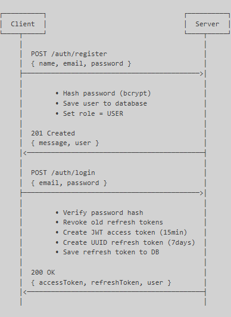
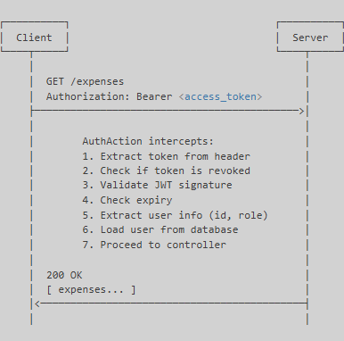
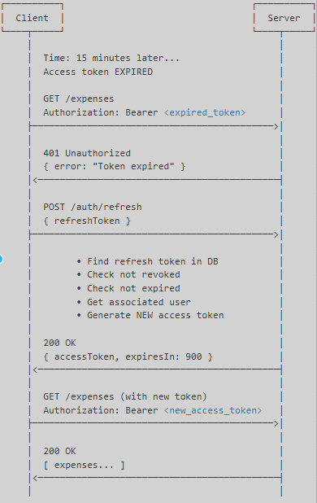
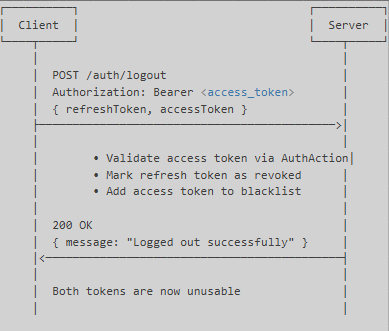

#### Expense Splitter API
A RESTful API built with Scala (Play Framework) for managing shared expenses, balances, and user authentication using JWT-based auth.
It enables users to register, log in, add shared expenses, and view who owes whom — just like real-world group expense apps.

---

## 📚 Table of Contents

 Architecture

 Endpoints

 Example Payloads

 Tech Stack

 Prerequisites

 Installation & Setup

 Authentication Flow

 Notes

 Postman Testing


---

# 🏗️ Architecture

The project follows a clean layered architecture:

Controllers → Handle HTTP requests & responses

Services → Contain business logic (auth, expenses, balances)

Repositories → Handle database interactions with Slick

Models → Represent database entities

Auth Layer → Manages JWT generation, validation, and refresh

gRPC Layer → Sends notifications asynchronously

Utils → Helper utilities for auth, hashing, etc.


## Database Schema

users

├── id (PK, AUTO_INCREMENT)

├── name

├── email (UNIQUE)

├── password_hash

├── role (USER/ADMIN)

└── created_at

expenses

├── id (PK, AUTO_INCREMENT)

├── expensename

├── amount

├── paid_by (FK → users.id)

└── created_at

expense_participants

├── id (PK, AUTO_INCREMENT)

├── expense_id (FK → expenses.id)

├── user_id (FK → users.id)

└── shared_amt

balances

├── id (PK, AUTO_INCREMENT)

├── sender (FK → users.id)

├── receiver (FK → users.id)

├── expense_id (FK → expenses.id)

├── amount

└── created_at

notifications

├── id (PK, AUTO_INCREMENT)

├── expense_id (FK → expenses.id)

├── notifier (FK → users.id)

├── message

└── created_at

refresh_tokens

├── id (PK, AUTO_INCREMENT)

├── user_id (FK → users.id)

├── token (UNIQUE)

├── expires_at

├── revoked

└── created_at

revoked_tokens
├── id (PK, AUTO_INCREMENT)

├── token

├── user_id (FK → users.id)

├── token_type (ACCESS/REFRESH)

├── revoked_at

├── expires_at

└── created_at

---

## 📦 Endpoints
## 🔐 Auth APIs

| Method | Endpoint         | Description                                    |
| ------ | ---------------- | ---------------------------------------------- |
| POST   | `/auth/register` | Register a new user                            |
| POST   | `/auth/login`    | Log in and receive access + refresh tokens     |
| POST   | `/auth/refresh`  | Refresh access token using valid refresh token |
| POST   | `/auth/logout`   | Revoke refresh token                           |

## 👥 Admin access APIs

| Method | Endpoint     | Description                           |
| ------ | ------------ | ------------------------------------- |
| GET    | `/users`     | Get all users                         |
| GET    | `/users/:id` | Get user details by ID                |

## 💰 Expense APIs (Protected)

| Method | Endpoint                 | Description                          |
| ------ | ------------------------ | ------------------------------------ |
| POST   | `/expenses`              | Create a new expense                 |
| GET    | `/expenses`              | Get all expenses                     |
| GET    | `/expenses/:id`          | Get a specific expense by ID         |
| GET    | `/expenses/user/:userId` | Get all expenses for a specific user |
| DELETE | `/expenses/:id`          | Delete an expense                    |

## ⚖️ Balance APIs (Protected)

| Method | Endpoint                       | Description                                |
| ------ | ------------------------------ | ------------------------------------------ |
| GET    | `/balances`                    | Get all balances                           |
| GET    | `/balances/user/:userId`       | Get all balances for a user                |
| GET    | `/balances/user/:userId/owes`  | Get balances where the user owes others    |
| GET    | `/balances/user/:userId/owed`  | Get balances where others owe the user     |
| GET    | `/balances/expense/:expenseId` | Get balances related to a specific expense |

---

## 🧪 Example Payloads

## ➕ Register User
```
POST /auth/register

{
  "name": "John Doe",
  "email": "john@example.com",
  "password": "Password123"
}
```

## 🔑 Login
```
POST /auth/login

{
  "email": "john@example.com",
  "password": "Password123"
}
```
## 🔄 Refresh Token
```
POST /auth/refresh

{
  "refreshToken": "a3f2c1b4-5678-90ab-cdef-1234567890ab"
}
```
## 🚪 Logout
```
POST /auth/logout
Headers: Authorization: Bearer <access_token>

{
  "refreshToken": "a3f2c1b4-5678-90ab-cdef-1234567890ab",
  "accessToken": "eyJhbGciOiJIUzI1NiIs..."
}
```

## Expenses
## 💵 Create Expense 
```
POST /expenses
Headers: Authorization: Bearer <access_token>

{
  "description": "Team Dinner",
  "amount": 600.0,
  "paidBy": 1,
  "participants": [
    { "userId": 1, "shareAmount": 200.0 },
    { "userId": 2, "shareAmount": 200.0 },
    { "userId": 3, "shareAmount": 200.0 }
  ]
}
```

## 🗑️ Delete Expense
```
DELETE /expenses/:id
Headers: Authorization: Bearer <access_token>
```

## Balances

## ⚖️ Get All Balances
```
GET /balances
Headers: Authorization: Bearer <access_token>
```

## ⚖️ Get User Balances
```
GET /balances/user/:userId
Headers: Authorization: Bearer <access_token>
```

## ⚖️ Get What User Owes
```
GET /balances/user/:userId/owes
Headers: Authorization: Bearer <access_token>
```

## ⚖️ Get What User Is Owed
```
GET /balances/user/:userId/owed
Headers: Authorization: Bearer <access_token>
```

## ⚖️ Get Expense Balances
```
GET /balances/expense/:expenseId
Headers: Authorization: Bearer <access_token>
```

---

## 🛠️ Tech Stack

## Backend

Language: Scala 2.13.16

Framework: Play Framework 3.0 (with Pekko)

Database ORM: Slick 5.1.0

Build Tool: sbt 1.9+

## Database

Production: MySQL (production db)

Testing   : MySQL (testing db)

Migrations: Play Evolutions

## Security & Authentication

JWT: java-jwt 4.4.0

Password Hashing: BCrypt (scala-bcrypt 4.3.0)

Token Strategy: Access Token (15 min) + Refresh Token (7 days)


## Testing

ScalaTest: 3.2.19

ScalaTestPlus Play: 7.0.2

Mockito Scala: 1.17.14


## ⚙️ Prerequisites

Java JDK 11+ (Recommended: JDK 17)

Scala 2.13.16

sbt (Scala Build Tool)

MySQL 8.0+

Git

## 🚀 Installation & Setup

Clone the repository:
```
git clone https://github.com/Praveena-g2005/ExpenseSplitter.git
cd ExpenseSplitter
```
Configure the database connection in:
```
conf/application.conf
```
Run the project:
```
# Compile
sbt compile

# Run (default port 9000)
sbt run

# Run on custom port
sbt "run 8080"

```
Default Admin User:
An admin user is automatically created:
```
Email: admin@example.com
Password: Admin@123
```
---
## 🔐 Authentication Flow

1. Registration & Login



2. Accessing Protected Routes



3. Token Refresh Flow



4. Logout Flow



---

## 🚧 Notes

✅ All passwords hashed with BCrypt

✅ JWT tokens signed and verified

✅ Refresh tokens can be revoked

✅ Access tokens have short expiry (15 min)

✅ Protected routes require authentication

✅ Admin-only routes enforce role checks

⚠️ Change default admin password immediately


---

## 🧪 Postman Testing

1. POST /auth/register              →  Create a user account
2. POST /auth/login                 →  Obtain access & refresh tokens
3. POST /expenses                   →  Add an expense (with Authorization header)
4. GET /balances                    →  Verify balance calculations
5. POST /auth/logout                →  Revoke tokens and end session
6. POST /auth/refresh               →  Refresh access token
7. GET /users                       →  Get all users (Admin only)
8. GET /users/:id                   →  Get specific user details (Admin only)
9. GET /expenses                    →  Get all expenses
10. GET /expenses/:id               →  Get specific expense details (Role based)
11. GET /expenses/user/:userId      →  Get expenses for specific user (Role based)
12. DELETE /expenses/:id            →  Delete an expense (Role based)
13. GET /balances/user/:userId      →  Get user balance summary
14. GET /balances/user/:userId/owes →  Get what user owes to others
15. GET /balances/user/:userId/owed →  Get what others owe to user
16. GET /balances/expense/:expenseId →  Get balances for specific expense